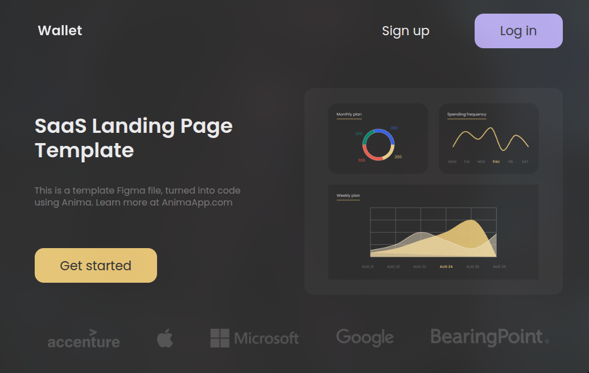

# 💳 Landing Page - Wallet SaaS

Учебный лендинг для SaaS-продукта (цифровой кошелёк). Третий проект - заметный скачок в качестве

---

## 🚀 Функционал

- Hero-секция с заголовком, описанием и CTA-кнопкой
- Секция превью с логотипами партнёров и мокапом приложения
- Секция с тремя feature-карточками и блоком отзыва пользователя
- Секция поддержки с CTA и анимированным GIF
- Футер с навигацией, копирайтом и формой подписки на email-рассылку
- Адаптивная вёрстка на 4 брейкпоинта (1279px / 991px / 767px / 575px)
- Fluid typography через `clamp()`
- Hover-эффекты на кнопках с `translateY`
- `@mixin text-format` и `@mixin flex-center` для переиспользования стилей

---

## 🛠 Стек технологий

- HTML5
- CSS3 / SCSS
- Методология: BEM
- Flexbox
- `clamp()` для fluid typography
- Git & GitHub

---

## 📸 Скриншоты

> 

---

## 📂 Структура проекта

```
landing-wallet/
├── src/
│   ├── css/
│   │   ├── style.css
│   │   └── style.css.map
│   ├── fonts/
│   │   ├── Poppins-Regular.ttf
│   │   └── Poppins-SemiBold.ttf
│   ├── icons/
│   │   ├── favicon/           ← полный набор favicon-файлов
│   │   ├── Cards icon.svg
│   │   ├── Coin icon.svg
│   │   ├── Logos.svg
│   │   ├── Purse icon.svg
│   │   ├── Star.svg
│   │   ├── User Feedback Image.svg
│   │   └── Wallet logo.svg
│   ├── img/
│   │   ├── app.svg
│   │   ├── cat.jpg
│   │   ├── diagram.svg
│   │   └── wallet.gif
│   ├── scss/
│   │   ├── style.scss         ← корневой файл
│   │   ├── _variables.scss    ← цвета + @font-face
│   │   ├── _mixins.scss       ← flex-center, text-format
│   │   ├── _reset.scss
│   │   └── _relative.scss     ← все медиа-запросы
│   └── index.html
└── README.md
```

---

## ⚙️ Запуск проекта

```bash
git clone https://github.com/xamiuez/landing-wallet.git
cd landing-wallet
```

**открыть `src/index.html` в браузере**adding: 80px 162px` ломается на мобиле
